<p align="center">
  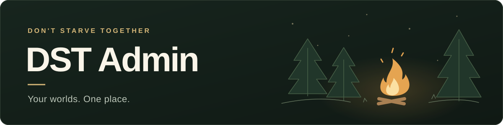
</p>

<p align="center">
  <a href="https://github.com/lcy0828/dst-admin-go/stargazers">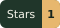</a>
  <a href="https://github.com/lcy0828/dst-admin-go/forks">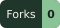</a>
  <a href="https://github.com/lcy0828/dst-admin-go/actions/workflows/ci.yml"></a>
  <a href="https://github.com/lcy0828/dst-admin-go/actions/workflows/package.yml">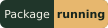</a>
</p>

<p align="center"><strong>From your first server to your next adventure.</strong></p>
<p align="center">
  Manage Don't Starve Together worlds, mods, players, and saves in your browser.<br>
  Start on one machine. Connect more with Agents when you need them.
</p>

<p align="center">
  <a href="README.md">简体中文</a> · <strong>English</strong>
</p>
<p align="center">
  <a href="#docker-quick-start">Quick start</a> ·
  <a href="#screenshots">Screenshots</a> ·
  <a href="#animated-demos">Animated demos</a> ·
  <a href="docs/startup-guide.en.md">Deployment guide</a> ·
  <a href="docs/luajit-installation.en.md">LuaJIT2</a> ·
  <a href="https://github.com/lcy0828/dst-admin-go/issues">Report an issue</a>
</p>

<p align="center">
  <a href="docs/assets/readme/dashboard.en.webp">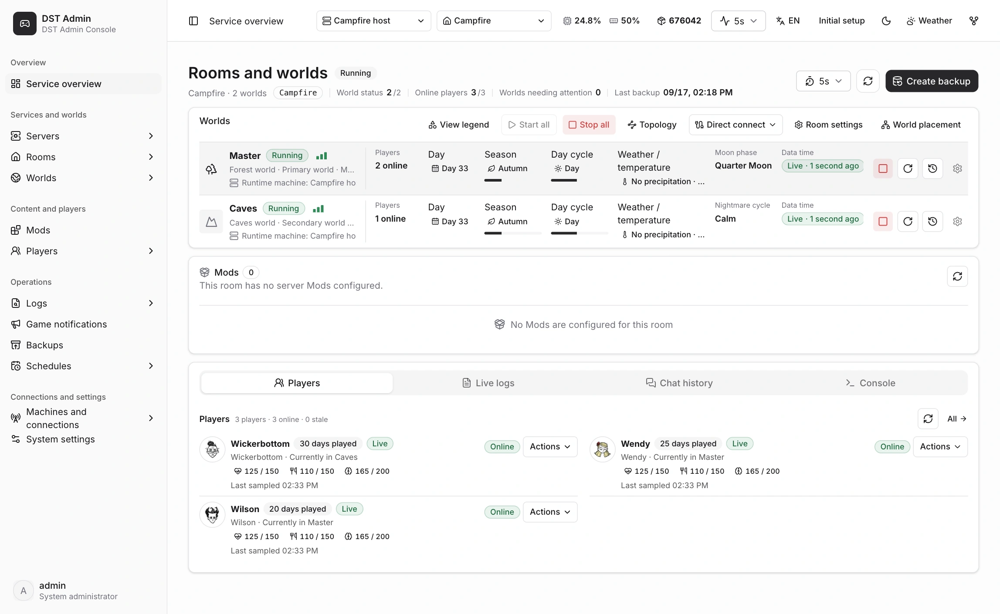</a>
  <br><sub>Current application UI · Demo data · Click to enlarge</sub>
</p>

## Everything you need to run your worlds

| Getting started | Day-to-day management |
| --- | --- |
| **Install the game and LuaJIT2**<br>Install or update the server from the panel, or connect an existing installation. | **Manage rooms and worlds**<br>Create rooms, start or stop Master and Caves, and monitor their status. |
| **Configure worlds and mods**<br>Edit room and world settings. Enable, configure, and update mods. | **Back up and restore saves**<br>Create backups, import existing saves, and restore your worlds when needed. |
| **Connect remote machines**<br>Manage other hosts through Agents and check each node's installations and resources. | **See what's happening**<br>Check players, seasons, logs, and chat. Run commands from the console. |

Images and native packages include the web UI. Chinese is the default, with English, color presets, and dark mode available. Animated weather can follow in-game seasons, time of day, and precipitation, or be previewed manually.

## Screenshots

Actual application screens with demo data. Click an image to enlarge.

<table>
  <tr>
    <td width="50%" valign="top"><strong>Browse the Workshop</strong><br><a href="docs/assets/readme/workshop.en.webp">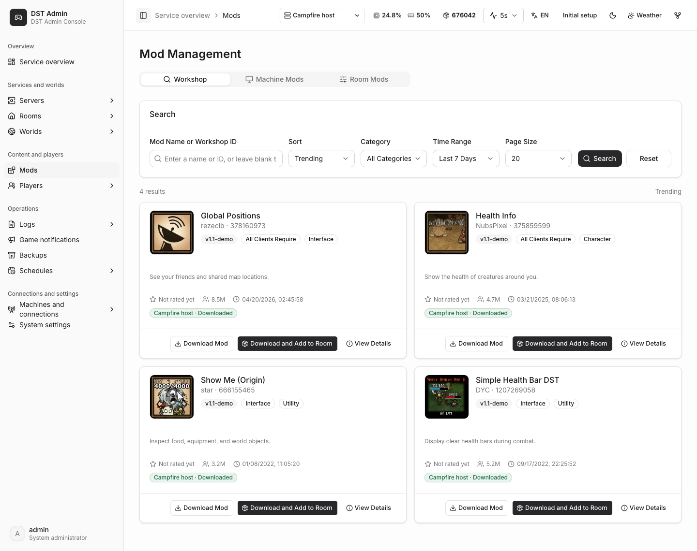</a><br><sub>Explore mod artwork and descriptions, download mods, and add them to a room.</sub></td>
    <td width="50%" valign="top"><strong>Room and world mods</strong><br><a href="docs/assets/readme/mods.en.webp">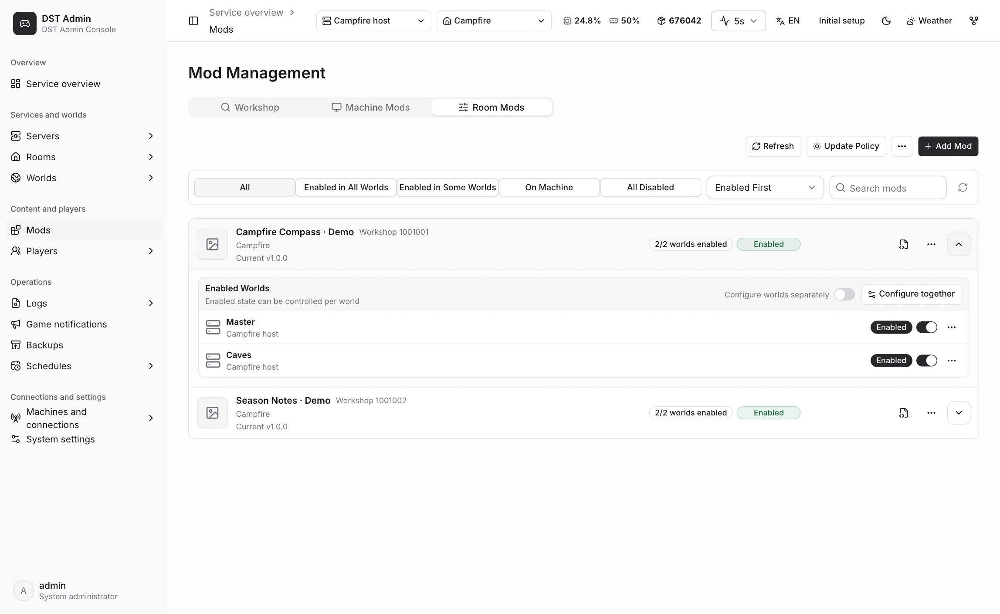</a><br><sub>Check versions and enabled worlds, with shared or per-world configuration.</sub></td>
  </tr>
  <tr>
    <td width="50%" valign="top"><strong>Game server management</strong><br><a href="docs/assets/readme/game.en.webp">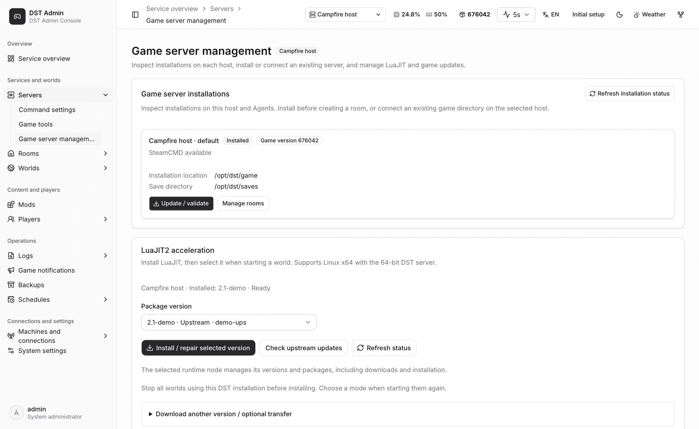</a><br><sub>Check installations, update the game, or connect an existing server.</sub></td>
    <td width="50%" valign="top"><strong>LuaJIT2 installation</strong><br><a href="docs/assets/readme/luajit.en.webp">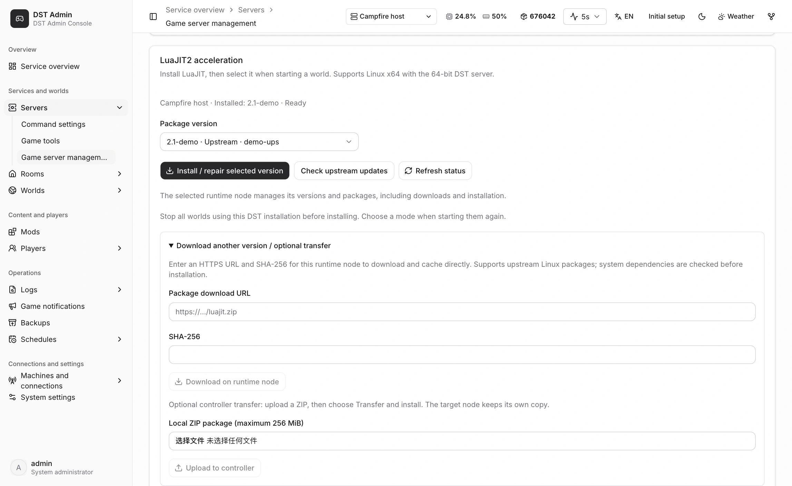</a><br><sub>Choose a version, check upstream releases, or import a package.</sub></td>
  </tr>
  <tr>
    <td width="50%" valign="top"><strong>Create an administrator</strong><br><a href="docs/assets/readme/setup.en.webp">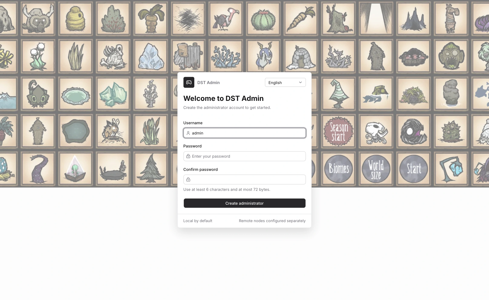</a><br><sub>Create your administrator account on first launch.</sub></td>
    <td width="50%" valign="top"><strong>Color themes and dark mode</strong><br><a href="docs/assets/readme/themes.en.webp">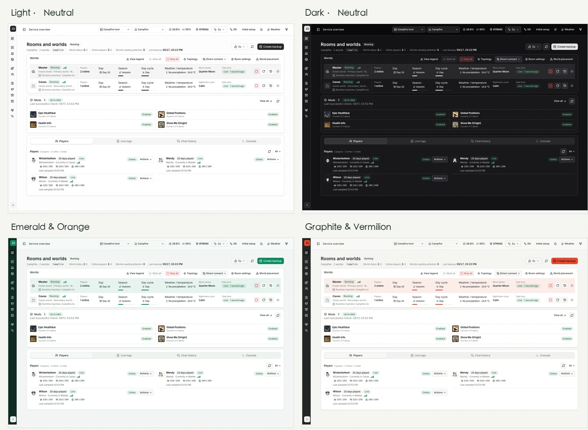</a><br><sub>Choose light or dark mode, a color preset, or your own theme color.</sub></td>
  </tr>
  <tr>
    <td width="50%" valign="top"><strong>Save backups and restore</strong><br><a href="docs/assets/readme/backups.en.webp">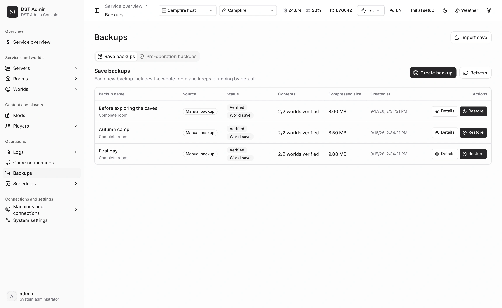</a><br><sub>Browse room backups, restore a world, or import saves.</sub></td>
    <td width="50%" valign="top"><strong>Player management</strong><br><a href="docs/assets/readme/players.en.webp">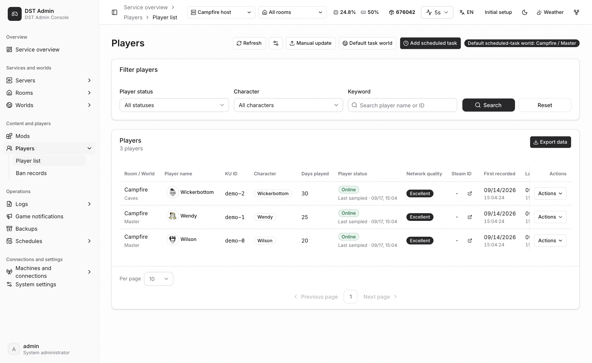</a><br><sub>View characters, player presence, and play history.</sub></td>
  </tr>
</table>

Mod names and artwork come from their Steam Workshop pages. See [image credits](docs/assets/readme/CREDITS.md).

## Animated demos

Recorded in the current UI using demo task and version data.

<details open>
<summary><strong>Update mods and restart worlds</strong></summary>

Confirm the update → download mods → follow Master / Caves restart progress → worlds return to running.

<p align="center">
  <a href="docs/assets/readme/mod-update.en.webp">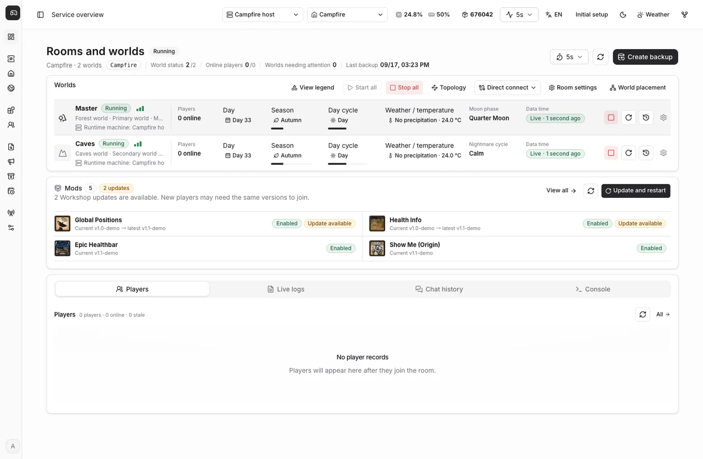</a>
</p>

</details>

<details open>
<summary><strong>Theme switching and animated weather</strong></summary>

Switch to dark mode and preview seasonal lighting, time of day, rain, and snow. Adjust intensity, pause, or end the preview.

<p align="center">
  <a href="docs/assets/readme/weather.en.webp">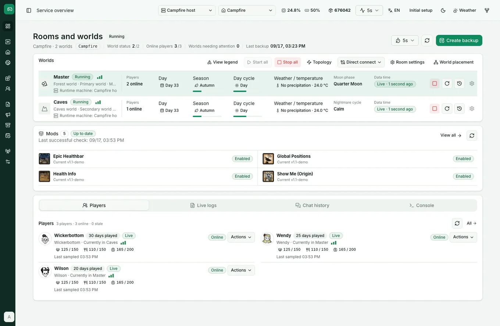</a>
</p>

</details>

## Docker quick start

Run the panel and game together on one machine. Recommended: **Linux x86_64 · 2 CPU cores / 4 GB RAM or more · 20 GB free disk space**. Install [Docker with Compose](https://docs.docker.com/engine/install/) first.

```bash
mkdir -p /opt/dst
cd /opt/dst
curl -fL https://raw.githubusercontent.com/lcy0828/dst-admin-go/master/deploy/docker/compose.all-in-one.yaml -o compose.yaml
docker compose up -d
```

The default is the **Alibaba Cloud registry**. No repository clone or `.env` is required. Outside mainland China, change `image` in `compose.yaml` to `lcy0828/dst-admin-go:latest` to use Docker Hub. Edit ports and the data mount directly in the same file.

Open **`http://SERVER_IP:8080`** and follow the setup wizard:

**Create an administrator → Install or connect the game → Add a [Klei Token](https://accounts.klei.com/account/game/servers?game=DontStarveTogether) → Create a room or import saves → Start your worlds**

> Data lives in `/opt/dst` by default: `saves/` holds game saves; `control/` holds configuration and the database. Keep the data directory and the mounts in `compose.yaml` when upgrading. Run `docker compose pull && docker compose up -d` from the deployment directory.

<details>
<summary><strong>Which ports should I open?</strong></summary>

Allow the ports you use through the host firewall and cloud security group. Default mappings:

| Purpose | Ports |
| --- | --- |
| Web UI | `8080/tcp` |
| Player connections | `10999-11020/udp` |
| Steam communication | `8766-8790/udp`, `27016-27040/udp` |

</details>

## Choose your deployment

| Your setup | Deployment |
| --- | --- |
| One machine for everything | **All-in-One**, using the steps above |
| Run binaries directly | [Native installation](docs/startup-guide.en.md) · [Download packages](https://github.com/lcy0828/dst-admin-go/releases/latest) |
| Manage more machines | [Connect a remote Agent](docs/startup-guide.en.md#connect-a-remote-agent) |
| Separate the panel and games | [Deployment profiles](docs/deployment-profiles.en.md) |

<details>
<summary><strong>Available Docker images, including Agent</strong></summary>

Use `latest` for stable releases or pin a `vX.Y.Z` version. All four services share [`lcy0828/dst-admin-go`](https://hub.docker.com/r/lcy0828/dst-admin-go) on Docker Hub and `registry.cn-hangzhou.aliyuncs.com/dstadmin/dst-admin-go` on Alibaba Cloud.

| Purpose | GHCR image suffix | Docker Hub / Alibaba Cloud tag |
| --- | --- | --- |
| Web UI, Controller, and local games | `all-in-one:latest` | `latest` |
| Web UI and Controller | `control-plane:latest` | `controller-latest` |
| Remote container Runtime management | `agent:latest` | `agent-latest` |
| Separate world runtime | `dst-runtime:latest` | `runtime-latest` |

Alibaba Cloud is recommended in mainland China and Docker Hub elsewhere. GHCR also remains available under `ghcr.io/lcy0828/dst-admin-go/`. Pin an Agent release with a tag such as `agent-v1.0.0`. `preview` is for testing. See [mirror configuration](docs/deployment-and-rollback.en.md#github-actions).

For remote machines running native game processes, use the native Agent package. See the [Agent setup guide](docs/startup-guide.en.md#connect-a-remote-agent).

</details>

## Explore further

- **Run and maintain**: [Game server installation](docs/game-installation-management.en.md) · [LuaJIT2 installation](docs/luajit-installation.en.md) · [Upgrades and rollback](docs/deployment-and-rollback.en.md)
- **Contribute**: [Development guide](docs/development.en.md) · [Frontend source](https://github.com/lcy0828/dst-admin-vue) · [Issue tracker](https://github.com/lcy0828/dst-admin-go/issues)

## Star history

<p align="center">
  <a href="https://github.com/lcy0828/dst-admin-go/stargazers">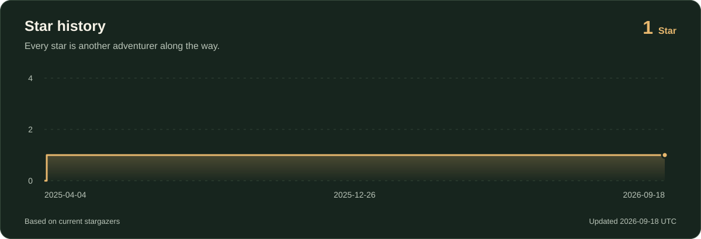</a>
</p>
