<p align="center">
  
</p>

<p align="center">
  <a href="https://github.com/lcy0828/dst-admin-go/stargazers"></a>
  <a href="https://github.com/lcy0828/dst-admin-go/forks"></a>
  <a href="https://github.com/lcy0828/dst-admin-go/actions/workflows/ci.yml"></a>
  <a href="https://github.com/lcy0828/dst-admin-go/actions/workflows/package.yml"></a>
</p>

<p align="center"><strong>从第一次开服，到每一天的冒险。</strong></p>
<p align="center">
  在浏览器里管理《饥荒联机版》的世界、模组、玩家与存档。<br>
  一台机器即可开始，也能通过 Agent 管理远程服务器。
</p>

<p align="center">
  <strong>简体中文</strong> · <a href="README.en.md">English</a>
</p>
<p align="center">
  <a href="#docker-快速安装">快速安装</a> ·
  <a href="#界面预览">界面预览</a> ·
  <a href="#动态演示">动态演示</a> ·
  <a href="docs/startup-guide.md">部署指南</a> ·
  <a href="docs/luajit-installation.md">LuaJIT2</a> ·
  <a href="https://github.com/lcy0828/dst-admin-go/issues">反馈问题</a>
</p>

<p align="center">
  <a href="docs/assets/readme/dashboard.zh.webp">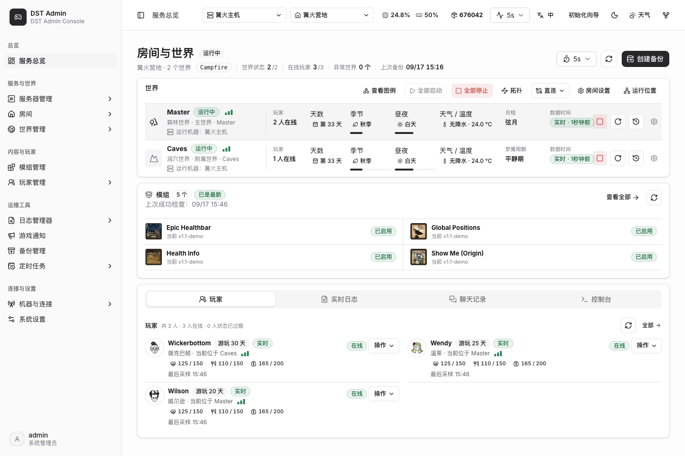</a>
  <br><sub>当前版本界面 · 演示数据 · 点击查看大图</sub>
</p>

## 开服与管理，都在这里

| 从零开始 | 日常管理 |
| --- | --- |
| **安装游戏与 LuaJIT2**<br>在页面安装、更新服务端，也可接入本机已有安装。 | **管理房间与世界**<br>创建房间，启动或停止 Master、Caves，查看运行状态。 |
| **配置世界与模组**<br>调整房间和世界设置，管理模组的启用、配置与更新。 | **备份与恢复存档**<br>创建备份、导入已有存档，需要时恢复世界。 |
| **接入远程机器**<br>通过 Agent 管理其他主机，查看各节点的安装与资源状态。 | **掌握游戏动态**<br>查看在线玩家、季节、日志与聊天记录，执行控制台命令。 |

镜像和原生安装包均内置管理页面。默认中文，支持英文、多套配色与深色模式；动态天气可跟随游戏中的季节、昼夜和降水，也可手动预览。

## 界面预览

真实产品界面，使用演示数据。点击图片查看大图。

<table>
  <tr>
    <td width="50%" valign="top"><strong>浏览创意工坊</strong><br><a href="docs/assets/readme/workshop.zh.webp">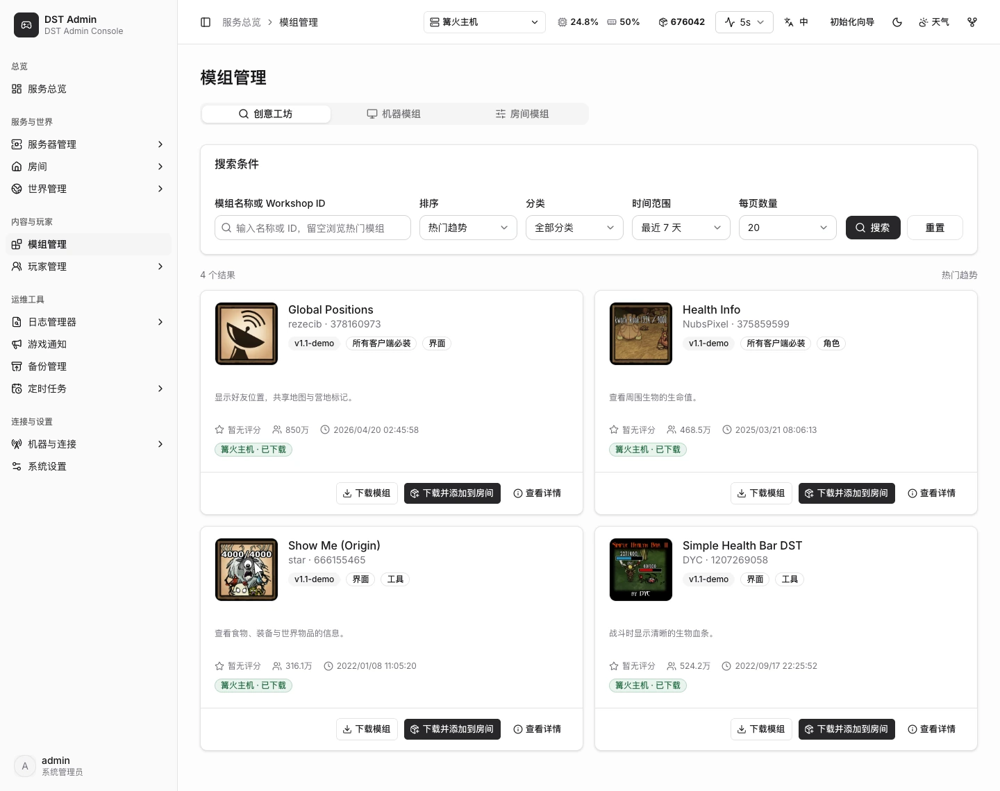</a><br><sub>查看模组封面与简介，搜索、下载并添加到房间。</sub></td>
    <td width="50%" valign="top"><strong>房间与世界模组</strong><br><a href="docs/assets/readme/mods.zh.webp">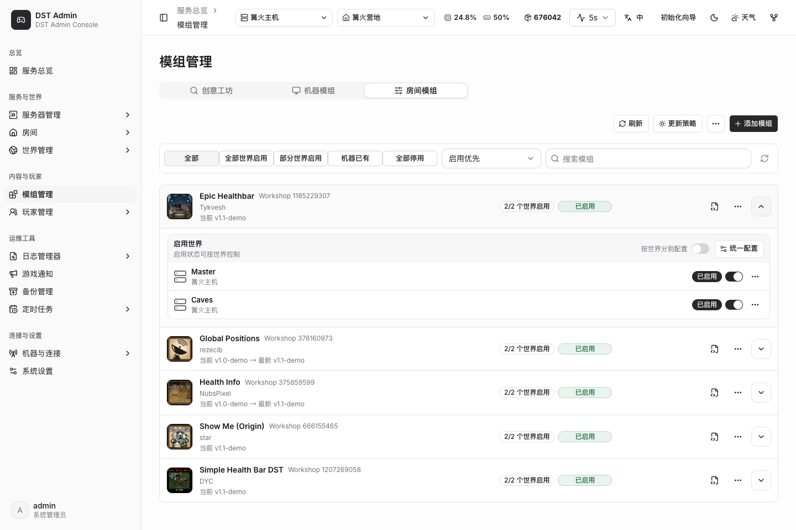</a><br><sub>查看版本和世界启用状态，统一或分别配置模组。</sub></td>
  </tr>
  <tr>
    <td width="50%" valign="top"><strong>游戏服务端管理</strong><br><a href="docs/assets/readme/game.zh.webp">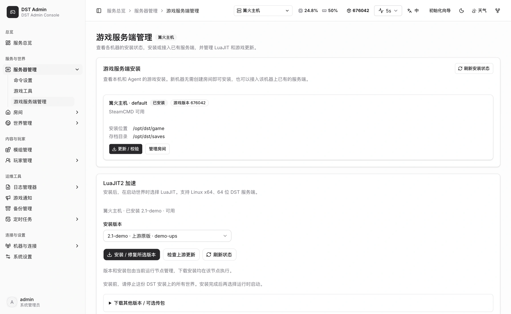</a><br><sub>查看安装状态，安装、更新或接入已有服务端。</sub></td>
    <td width="50%" valign="top"><strong>LuaJIT2 安装</strong><br><a href="docs/assets/readme/luajit.zh.webp">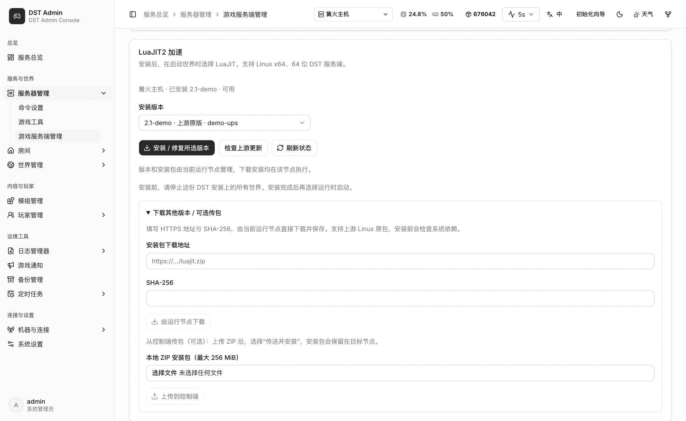</a><br><sub>选择版本，检查上游更新，按需导入安装包。</sub></td>
  </tr>
  <tr>
    <td width="50%" valign="top"><strong>创建管理员</strong><br><a href="docs/assets/readme/setup.zh.webp">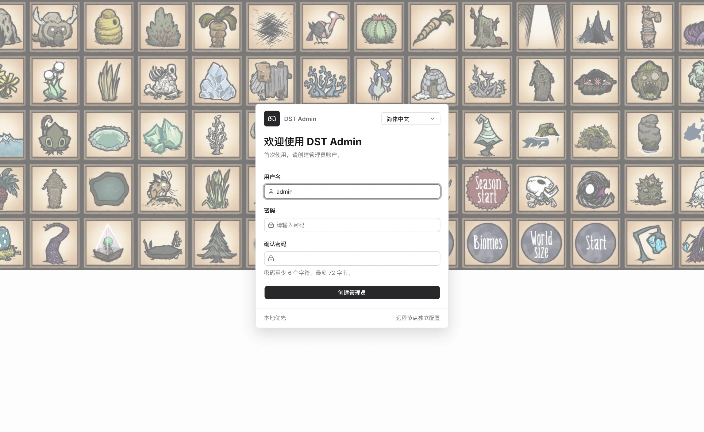</a><br><sub>首次启动创建自己的管理账户。</sub></td>
    <td width="50%" valign="top"><strong>主题配色与深色模式</strong><br><a href="docs/assets/readme/themes.zh.webp">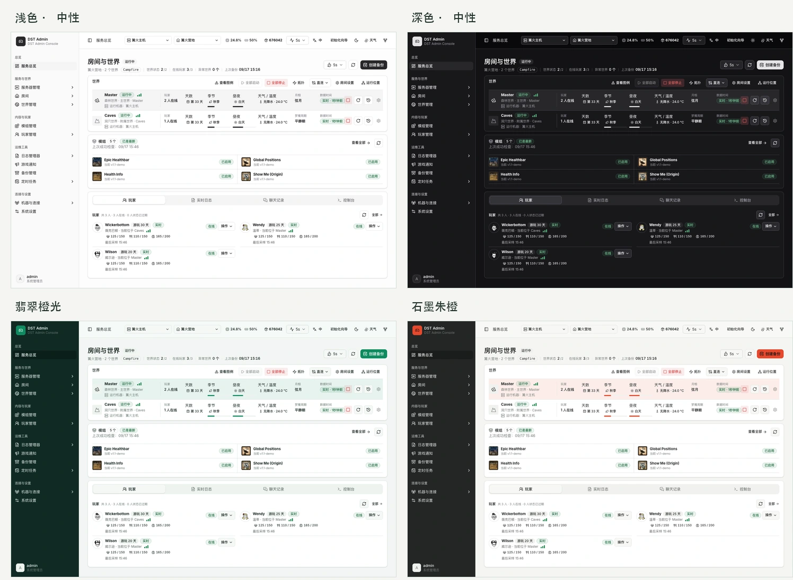</a><br><sub>浅色、深色与配色预设，也支持自定义主题色。</sub></td>
  </tr>
  <tr>
    <td width="50%" valign="top"><strong>存档备份与恢复</strong><br><a href="docs/assets/readme/backups.zh.webp">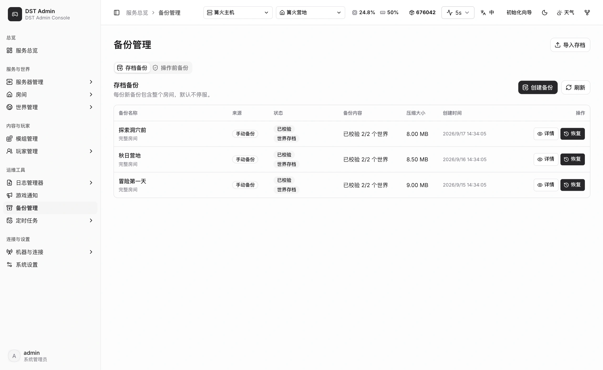</a><br><sub>查看完整房间备份，按需恢复或导入存档。</sub></td>
    <td width="50%" valign="top"><strong>玩家管理</strong><br><a href="docs/assets/readme/players.zh.webp">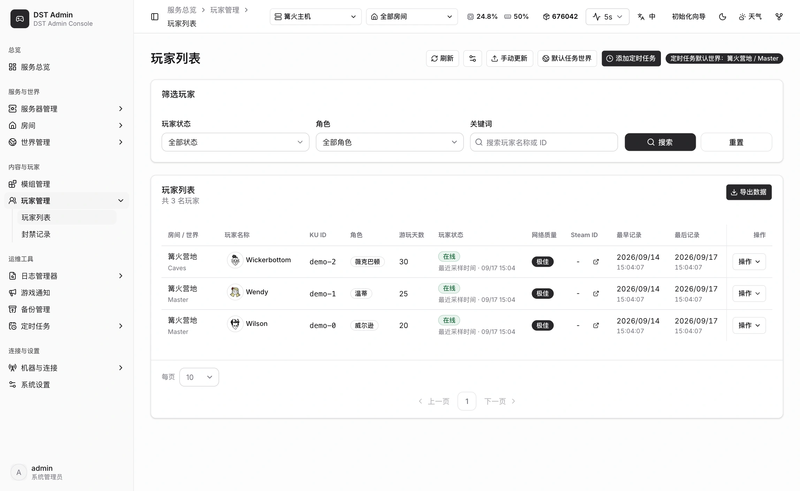</a><br><sub>查看角色、在线状态与游玩记录。</sub></td>
  </tr>
</table>

模组名称与封面来自对应的 Steam Workshop 页面，见[素材来源](docs/assets/readme/CREDITS.md)。

## 动态演示

真实界面录制，使用演示任务和版本数据。

<details open>
<summary><strong>更新模组并重启世界</strong></summary>

确认更新 → 下载模组 → 查看 Master / Caves 重启进度 → 世界恢复运行。

<p align="center">
  <a href="docs/assets/readme/mod-update.zh.webp">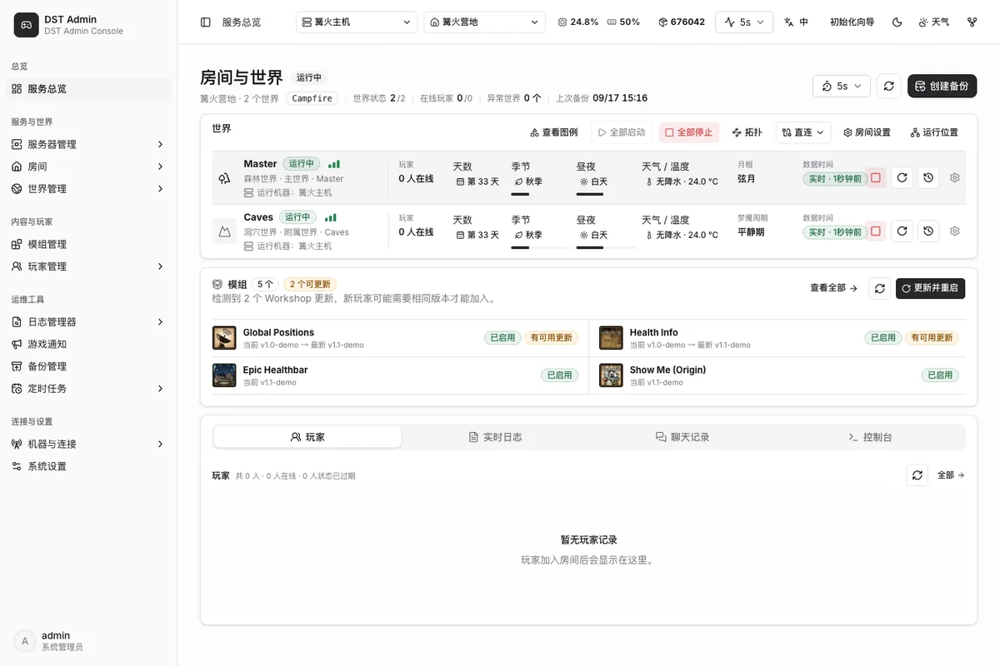</a>
</p>

</details>

<details open>
<summary><strong>主题切换与动态天气</strong></summary>

切换深色模式，预览季节与昼夜光效、下雨和下雪；可调节强度、暂停或结束预览。

<p align="center">
  <a href="docs/assets/readme/weather.zh.webp">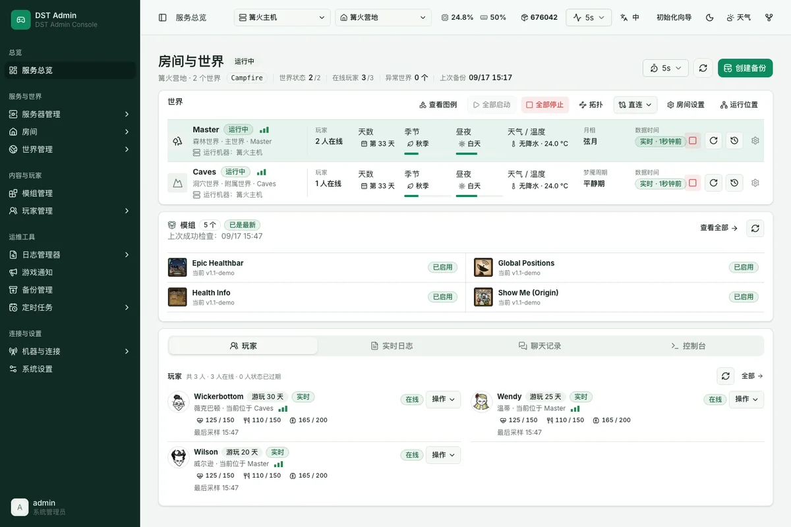</a>
</p>

</details>

## Docker 快速安装

适合一台机器同时运行面板和游戏。推荐 **Linux x86_64 · 2 核 / 4 GB 内存起 · 20 GB 空闲磁盘**，先安装 [Docker 和 Compose](https://docs.docker.com/engine/install/)。

**1. 获取部署文件**

```bash
git clone https://github.com/lcy0828/dst-admin-go.git
cd dst-admin-go/deploy/docker
cp all-in-one.env.example .env
```

**2. 编辑 `.env`，设置镜像与数据目录**

```ini
DST_ADMIN_IMAGE=ghcr.io/lcy0828/dst-admin-go/all-in-one:preview
DST_ADMIN_DATA_ROOT=/opt/dst
```

**3. 启动面板**

```bash
docker compose --env-file .env -f compose.all-in-one.yaml up -d
```

打开 **`http://服务器IP:8080`**，跟随初始化向导完成：

**创建管理员 → 安装或接入游戏 → 填写 [Klei Token](https://accounts.klei.com/account/game/servers?game=DontStarveTogether) → 创建房间或导入存档 → 启动世界**

> 数据默认保存在 `/opt/dst`：`saves/` 是存档，`control/` 是配置和数据库。升级时保留此目录与原 `.env`。

<details>
<summary><strong>需要开放哪些端口？</strong></summary>

在主机防火墙和云服务器安全组中放行实际使用的端口。默认映射如下：

| 用途 | 端口 |
| --- | --- |
| 管理页面 | `8080/tcp` |
| 玩家连接 | `10999-11020/udp` |
| Steam 通信 | `8766-8790/udp`、`27016-27040/udp` |

</details>

## 选择适合你的部署

| 使用场景 | 部署方式 |
| --- | --- |
| 一台机器开服 | **All-in-One**，按上面的步骤开始 |
| 直接运行二进制 | [原生安装指南](docs/startup-guide.md) · [下载安装包](https://github.com/lcy0828/dst-admin-go/actions/workflows/package.yml) |
| 管理更多机器 | [接入远程 Agent](docs/startup-guide.md#接入远程-agent) |
| 控制端与游戏分开部署 | [部署方案](docs/deployment-profiles.md) |

<details>
<summary><strong>可用的 Docker 镜像（包含 Agent）</strong></summary>

镜像前缀：`ghcr.io/lcy0828/dst-admin-go/`，当前标签：`preview`。

| 镜像 | 用途 |
| --- | --- |
| `all-in-one` | 管理页面、控制端和本机游戏 |
| `control-plane` | 管理页面和控制端 |
| `agent` | 远程容器 Runtime 管理 |
| `dst-runtime` | 独立世界运行环境 |

远程机器直接运行原生游戏进程时，使用原生 Agent 安装包。具体配置见[部署指南](docs/startup-guide.md#接入远程-agent)。

</details>

## 继续探索

- **开服与维护**：[游戏服务端安装](docs/game-installation-management.md) · [LuaJIT2 安装](docs/luajit-installation.md) · [升级与回滚](docs/deployment-and-rollback.md)
- **参与开发**：[开发指南](docs/development.md) · [前端源码](https://github.com/lcy0828/dst-admin-vue) · [问题反馈](https://github.com/lcy0828/dst-admin-go/issues)

## Star 趋势

<p align="center">
  <a href="https://github.com/lcy0828/dst-admin-go/stargazers">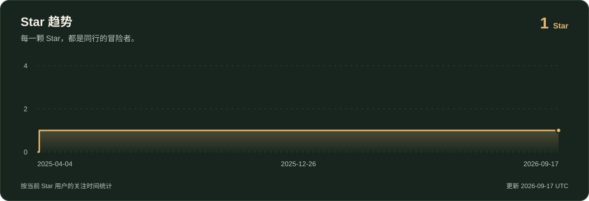</a>
</p>
